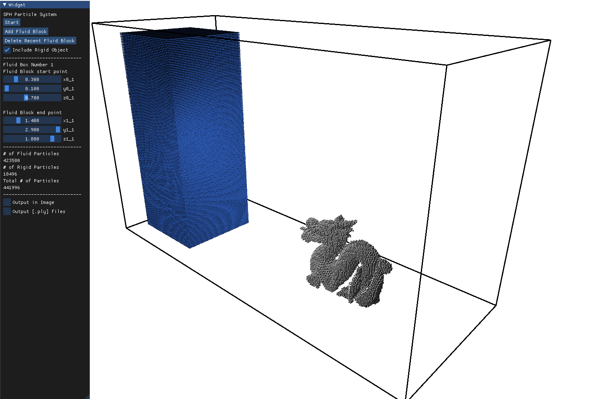
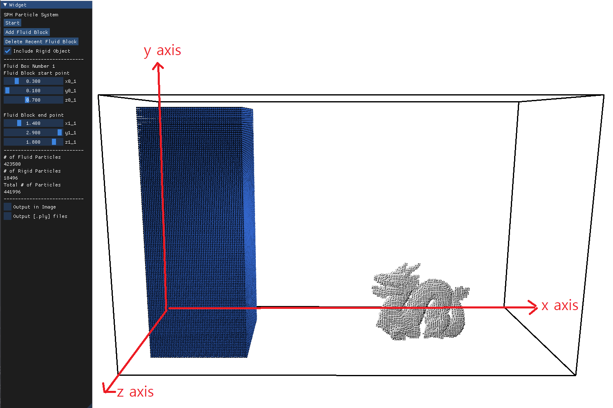
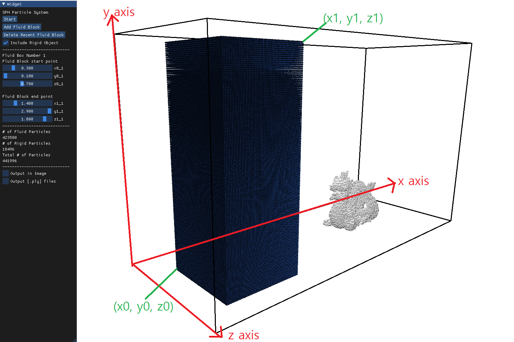
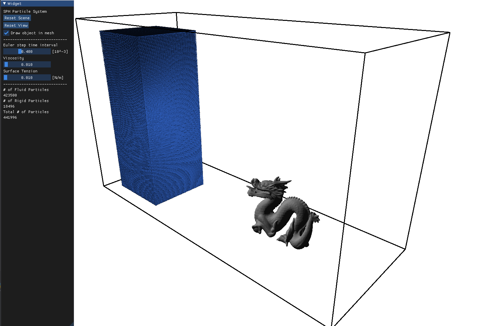

# Smoothed Particle Hydrodynamics
### **SPH**(Smoothed-particle hydrodynamics) implementation with built-in adjustable parameter using Taichi Lang.

## Objective
- **Smoothed-particle hydrodynamics** (SPH) is a computational method used for simulating the mechanics of continuum media, such as solid mechanics and fluid flows. It is a meshfree Lagrangian method (where the co-ordinates move with the fluid), and the resolution of the method can easily be adjusted with respect to variables such as density.[wiki] 

- SPH was originally developed for astrophysical problems. To glance over the basic of SPH, you may find useful to cosult the following toy project [Simulating star with SPH](https://github.com/sillsill777/vpython-projects).

- In this project with the SPH formalism, we will numerically solve fluid equations which governs the movement of fluid flow. Further we will consider several effects governing fluid motion such as viscosity and surface tension. Also handle the issue of Fluid-Rigid coupling.

## Results
- #### Default setting

[Fig. 1 Default setting]

[Fig. 2 Default setting rendered using Houdini]

- - -
 
- #### High Viscosity case with viscosity set to 0.5

[Fig. 3 High Viscosity case]

[Fig. 4 High Viscosity case rendered using Houdini]

- - -

- #### Two fluid block case

[Fig. 5 Two fluid block setting]

[Fig. 6 Two fluid block setting rendered using Houdini]

- - -

## Requirements

- taichi
- trimesh
- numpy

## Key assignment of the program to moving around the scene

- `Drag right mouse button` : Rotating the camera view
- `w, s` : Zoom in and out
- `a, d` : moving left and right
- `q, e` : moving up and down

- - -

## Program Description
- Our program consists of two phases. First phase is set-up phase for simulating SPH and second phase is a simulation phase.  
### First Phase (set-up phase)
- If you run the `run_simulation.py`, you will see the following window.

[Fig. 7 Phase1]

This is the phase where you can edit the SPH particle system. For example, you can change the width, height and depth of fluid blocks. Further you can add more fluid blocks and decide whether to include static rigid body(dragon sculpture) for simulation.

- Axis description and definition of `(x0, y0, z0)` and `(x1, y1, z1)`

[Fig. 8 Axis description]

[Fig. 9 (x0, y0, z0) and (x1, y1, z1)]

- - -

- #### Widget Option Description

`Start` : Start the SPH simulation. (Going to phase 2)

`Add Fluid Block` : Add aditional fluid block. By this feature you can simulate two fluid block just as [Fig. 5] and [Fig. 6]. But adding fluid blocks and moving it, possibly can yield GPU memory problem. To avoid this issue I suggest you to first read the :warning: WARNING :warning: part just below and read this [additional section](#two-fluid-block-case-set-up-demonstration) demonstrating set-up of two fluid block configuration.

`Delete Recent Fluid Block` : Delete most recent fluid block.

`Include Rigid Object` : Whether to include static rigid body(dragon sculpture) for simulation. If it is not checked, then rigid body will not be presented in simulation.

`x0_{}, y0_{}, z0_{}` : Fluid block { } start point. Since by default there is only one fluid block, there exists only `x0_1, y0_1, z0_1` . If you add more fluid block by `Add Fluid Block` , then there will be more slider bar to adjust the position of fluid block. Eacn slider range from minimal possible point (`origin` + some margin) to maximal possible point ( `(x1, y1, z1)` - some margin).

`x1_{}, y1_{}, z1_{}` : Fluid block { } end point. You can find the definition of `(x0, y0, z0)` and `(x1, y1, z1)` in the [Fig. 9]. (marked as green) Eacn slider range from minimal possible point ( `(x0, y0, z0)` + some margin) to maximal possible point ( `maxium boundary point` (black line vertex) - some margin).

### :warning: WARNING :warning: : Due to GPU memory problem, when you want to change the value of `(x0, y0, z0)` and `(x1, y1, z1)` you must **click** the point you want that value to be located not sliding the bar. Please consult the following gif.

`# of Fluid Particles, # of Rigid Particles, Total # of Particles` : Giving you information about how many particles are there in current setting. By default setting, total number of particles are about 442k. If you increase the size of fluid block or add additional fluid block, you will see the increment in the number of particles. But you should be aware that the more particles exists, the more time for numerical calculation is needed.

`Output in Image` : If you check the checkbox then in simulation part, rendered image showing on the window will be exported to the file `./Dragon Bath_output_img/` in the `.png` form. Exporting interval can be adjusted by changing the value of `outputInterval` inside the `./data/scenes/dragon_bath.json` . Default value is 40, meaning program will export image every 40 frames.

`Output [.ply] files` : If you check the checkbox then in simulation part, `.ply` files containing the information of each fluid particles position will be exported to `./Dragon Bath_output/` , also including the mesh information of rigid body in `.obj` form. You can use these files, `.ply` , `.obj` , to render it like a real water and real object using **Houdini** or **Blender**.

- - -

### Second Phase (simulation phase)
- After clicking `Start` button in first phase, you will enter second phase which looks like following image.

[Fig. 10 Phase2]

This is the phase where actual SPH simulation is performed based on your given set-up in first phase. During the simulation you can adjust viscosity, surface tension parameter in **real-time** and see the corresponding effect instantly. Also you can change the Euler method (forward Euler method) time step to speed up the simulation. 

- #### Widget Option Description

`Reset Scene` : By clicking this button, you can restart the simulation from the start. It is useful when you've changed the viscosity or surface tension and to see the corresponding effect from the beginning of the simulation.

`Reset View` : By clicking this button, the view(camera) will be reset to the default view.

`Draw object in mesh` : Whether to draw the rigid object in mesh or particles. By default program draws rigid object in mesh but internally numerical computation between fluid and rigid object is based on particlized rigid object. So some behaviors such as fluid around objects or fluid particle sticking to the surface of rigid object is better explained when rigid object is drawn in particles rather than mesh. 

`Euler step time interval` : Can change the time step when performing forward Euler method. Increasing this value will speed up the simulation. But at some situations including very high viscosity, very high surface tension or extreme amount of fluid particles, SPH simulator is likely to experience numerical instability and even computation blow up. This kind of misbehavior indicates that Euler method time step is too large. **So when simulator blows up, try to lower the time step and reset the scene.** Default time step is 0.0004. Actually for the high viscosity and high surface tension, the maximum time step is adjusted to prevent numerical instability. Even though there might be some misbehavior in your particular set-up. So if that happens just lower the time step.

`Viscosity` : Can change the viscosity. Unlike the phase 1, you can slide the bar or just click the point in the slider as you did in phase1. Two behaviors are all acceptable in phase2. Incresaing the viscosity will yiled sticky behavior to the fluid like the honey. Default value is 0.01

`Surface Tension` : Can change the surface tension. Increasing the surface tension yields the tendency for the fluid particles to stick each other to form spherical shape. One thing to notice is that at extremely high surface tension, the behavior of fluid seems unrealistic. Try changing these values to find different behaviors fluid exhibits. Default value is 0.01 

- - -

## Additionals

### Two fluid block case set-up demonstration

- In this part, I demonstrate how to set-up two fluid case which results in [fig. 5] and [Fig. 6]. Following similar step you can even add more fluid blocks if you want, given that your GPU device can handle. Although in our case we intended not to include rigid body in our simulation for clarity, it does not matter you include rigid body or not, regradless of number of fluid blocks.

[Fig. 11 Two fluid block set-up demonstration]

As in the :warning: WARNING :warning:, you have to click the position in the slider to change the fluid box positions. If you add the fluid box by clicking `Add Fluid Block` then added fluid block will appear in the position same as most recent fluid block. So you have to move the added fluid block to properly render the system at Phase2. 
### :warning: As the demonstration gif suggets, when moving additional fluid blocks, first change the `(x0, y0, z0)` value to move the lowest part of fluid block and then adjust `(x1, y1, z1)` to move forward. I am suggesting you this method because if you move added fluid block by increasing `(x1, y1, z1)` first, then **GPU memory allocation** error will likely to occur. (In the gif I move the second fluid block in positive x direction, by first increasing x0 value and then gradually increase x1 value to move forward and repeat this process several times.) :warning:

- - -

## Acknowledgement

Our project is mainly based on this amazing project [SPH Taichi](https://github.com/erizmr/SPH_Taichi). Sending all thanks to [Mingrui Zhang](https://github.com/erizmr) who wrote such a nice code and has provided necessary feedbacks for me. 

## References

- [Peter J. Cossins : Smoothed Particle Hydrodynamics](https://arxiv.org/abs/1007.1245v2)

- [Markus Becker, Matthias Teschner : Weakly compressible SPH for free surface flows](https://cg.informatik.uni-freiburg.de/publications/2007_SCA_SPH.pdf)

- [B. Solenthaler, R. Pajarola : Density Contrast SPH Interfaces](https://people.inf.ethz.ch/~sobarbar/papers/Sol08b/Sol08b.pdf)

- [Nadir Akinci, Markus Ihmsen : Versatile Rigid-Fluid Coupling for Incompressible SPH](https://cg.informatik.uni-freiburg.de/publications/2012_SIGGRAPH_rigidFluidCoupling.pdf)

- [Houdini rendering tutorial](https://www.youtube.com/watch?v=AmnKMmEor9I)
